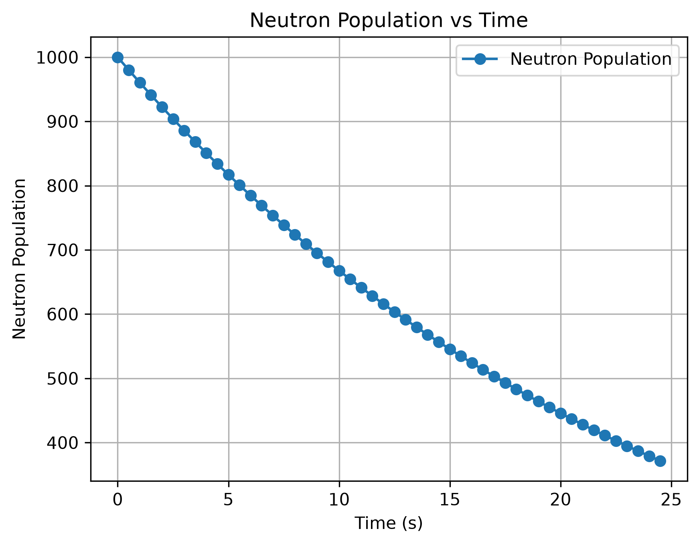

# Reactor Power Simulation

## Overview

This project is a Python-based simulation of nuclear reactor power behavior. The goal is to model how reactor power changes over time in response to reactivity insertions, control rod movements, and temperature feedback effects.

This project combines concepts from Nuclear Engineering and Data Science using computational modeling and data analysis.

---

## Project Goals

- Simulate reactor power as a function of time
- Model control rod insertion and withdrawal
- Incorporate temperature feedback effects
- Generate simulation datasets
- Analyze reactor behavior using data science techniques
- Visualize reactor performance through plots and dashboards

---

## Technologies


- Python
- Jupyter Notebook
- Pandas
- Matplotlib
- Git
- GitHub
- Visual Studio Code
---

## Project Workflow

Physics Model
      ↓
Time-Step Simulation
      ↓
Data Collection (Pandas)
      ↓
Visualization (Matplotlib)
      ↓
Engineering Analysis
---

## Current Status

🚧 Active Development

Current milestone:
- Constant reactivity simulation completed
- Data collection completed
- Visualization completed

Next milestone:
- Time-dependent reactivity
- Control rod model

### Planned Features

- [ ] Basic reactor power model
- [ ] Control rod model
- [ ] Temperature feedback model
- [ ] Data generation
- [ ] Data analysis
- [ ] Interactive visualizations


---
## Current Features

- Constant reactivity simulation
- Neutron population time stepping
- Adjustable simulation time step
- Simulation history stored in Python lists
- Results organized using Pandas
- Results exported to CSV
- Neutron population visualization using Matplotlib
---
## Current Results

The first milestone of the project models neutron population growth under constant positive reactivity. The simulation stores results in a Pandas DataFrame and visualizes the behavior using Matplotlib.

##   Reactivity Simulation Output

The graph below shows how the neutron population changes over time under constant positive reactivity.


## Repository Structure

```text
reactor-power-simulation/
├── data/
│   └── simulation_results.csv
├── images/
│   └── neutron_population.png
├── notebooks/
│   └── reactor-sim.ipynb
├── src/
└── README.md
```

---

## Author

**Favour Olawole**

University of Illinois Urbana-Champaign

Interests:
- Nuclear Engineering
- Reactor Physics
- Computational Modeling
- Data Science
