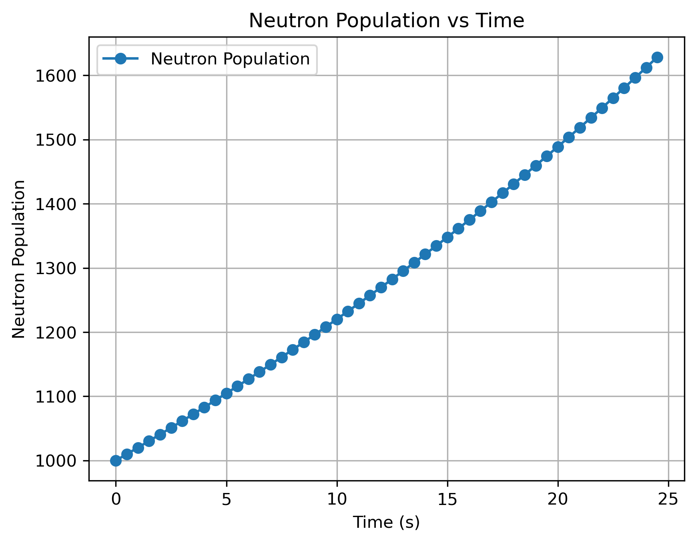
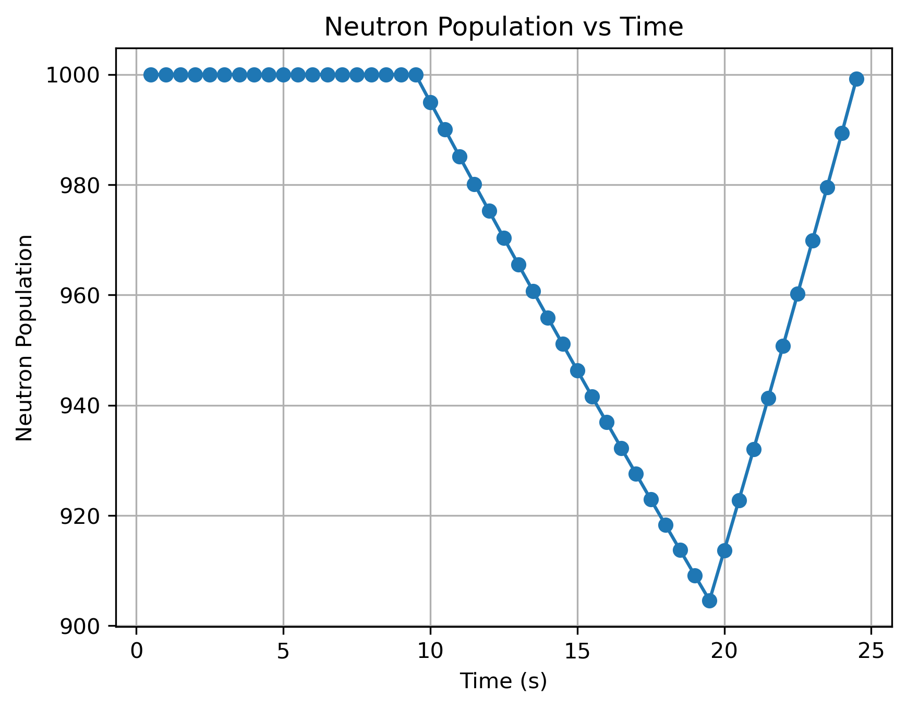
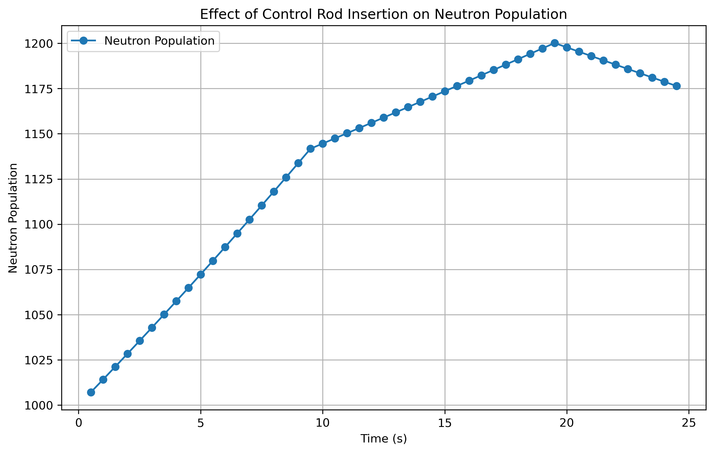
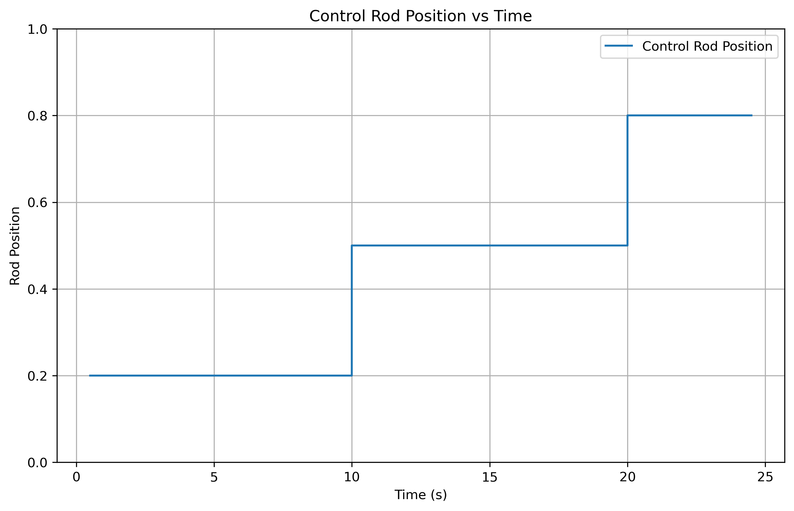
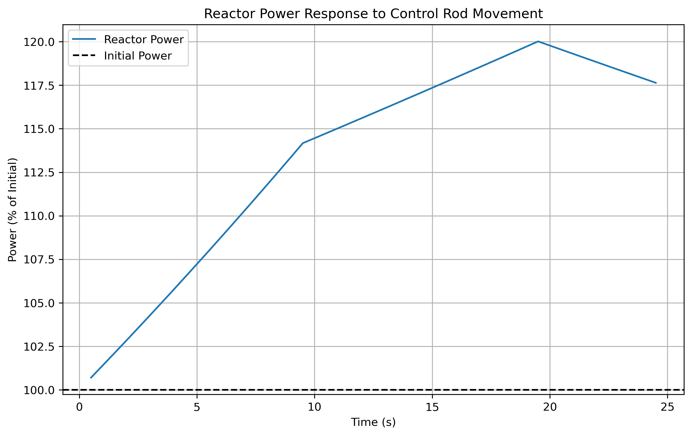
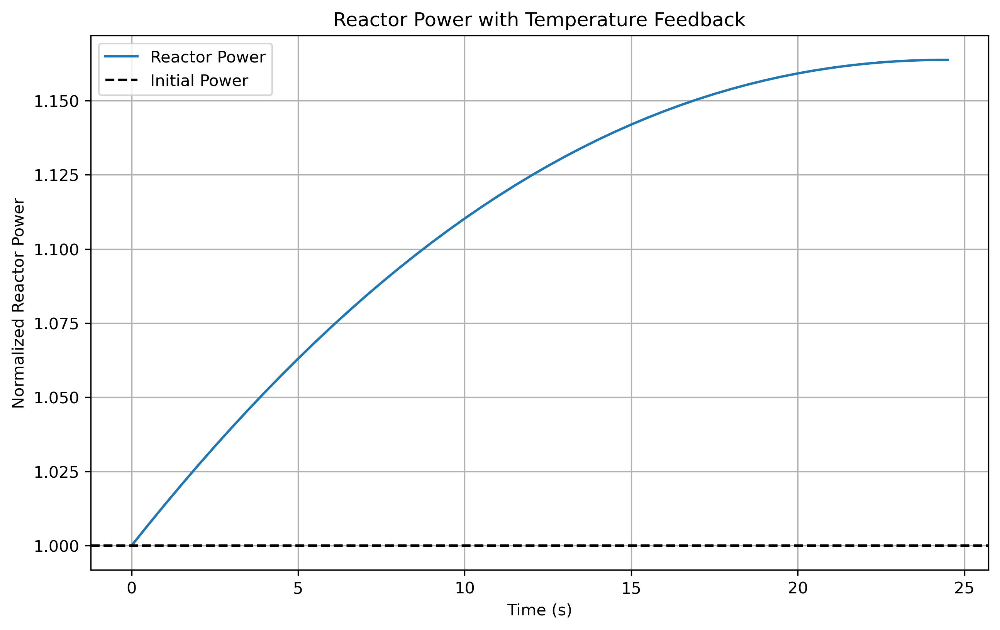
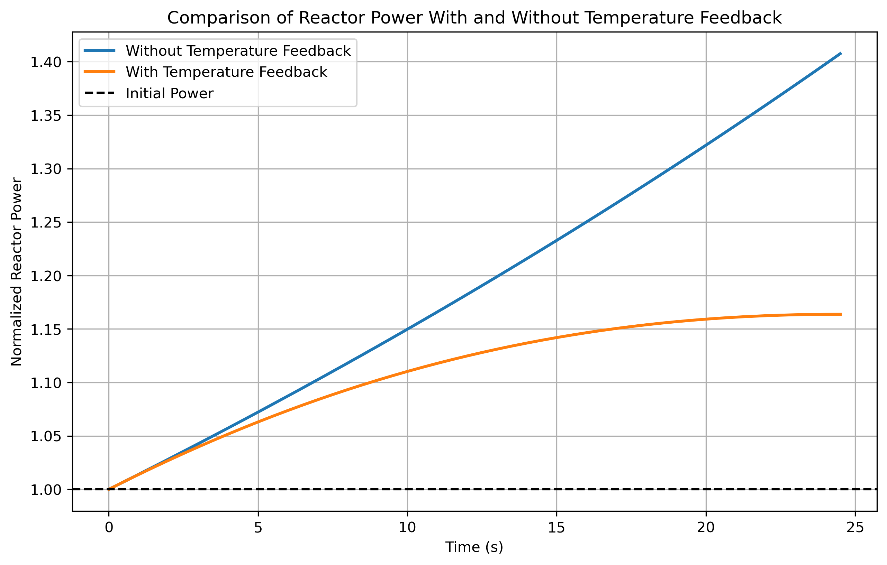

# Reactor Power Simulation

**Favour Olawole**
University of Illinois Urbana-Champaign
Nuclear, Plasma and Radiological Engineering + Data Science

## Overview

This project is a Python-based simulation of nuclear reactor power behavior. The goal is to model how neutron population and reactor power change over time in response to reactivity changes, control rod movements, and temperature feedback effects.

This project combines concepts from Nuclear Engineering and Data Science using computational modeling, numerical methods, data analysis, and visualization.

---

## Project Goals

* Simulate neutron population and reactor power as functions of time
* Model constant and time-dependent reactivity
* Simulate the effects of control rod insertion
* Incorporate negative temperature feedback
* Generate simulation datasets
* Analyze reactor behavior using Pandas
* Visualize simulation results using Matplotlib
* Compare reactor power with and without temperature feedback

---

## Technologies

* Python
* Jupyter Notebook
* Pandas
* Matplotlib
* Git
* GitHub
* Visual Studio Code

---

## Project Workflow

Physics Model

↓

Time-Step Simulation

↓

Data Collection (Pandas)

↓

Visualization (Matplotlib)

↓

Engineering Analysis

---

## Simulation Components

### 1. Constant Reactivity

Models neutron population growth under a constant positive effective growth rate.

The simulation calculates neutron population at each time step, stores the results in a Pandas DataFrame, and visualizes neutron population over time.

### 2. Time-Dependent Reactivity

Models neutron population behavior under changing effective growth-rate conditions.

The simulation includes three operating periods:

* 0–10 seconds: Zero growth rate
* 10–20 seconds: Negative growth rate
* 20 seconds onward: Positive growth rate

### 3. Control Rod Movement

Models the effect of control rod insertion on neutron population and reactor power.

The simulation uses three control rod positions:

* 20% inserted
* 50% inserted
* 80% inserted

The model calculates the control rods' contribution to the total effective growth rate and demonstrates how increasing insertion affects neutron population.

### 4. Reactor Power

Calculates normalized reactor power using the relationship between neutron population and power.

The simulation uses:

$$
\frac{P(t)}{P_0}=\frac{N(t)}{N_0}
$$

Where:

* P(t) = reactor power at time t
* P₀ = initial reactor power
* N(t) = neutron population at time t
* N₀ = initial neutron population

### 5. Temperature Feedback

Models the effect of negative temperature feedback on reactor power.

The simulation calculates temperature changes over time and uses those changes to determine the temperature feedback contribution to the effective growth rate.

### 6. Power Comparison

Compares reactor power behavior with and without negative temperature feedback under identical initial conditions.

The simulation generates a comparison graph and calculates final normalized power, maximum normalized power, and the time of peak power in the feedback case.

---

## Project Results

### Constant Reactivity Simulation

Demonstrates neutron population growth under constant positive effective growth rate.



### Time-Dependent Reactivity Simulation

Demonstrates how neutron population changes under zero, negative, and positive effective growth rates.



### Control Rod Simulation

Demonstrates the effect of increasing control rod insertion on neutron population.



### Control Rod Position

Shows the control rod positions used throughout the simulation.



### Reactor Power

Shows normalized reactor power in response to control rod movement.



### Temperature Feedback

Shows how reactor power changes when negative temperature feedback is incorporated into the simulation.



### Power Comparison

Compares reactor power behavior with and without negative temperature feedback.



---

## Model Limitations

This project uses simplified reactor dynamics for educational purposes.

The variable labeled reactivity in the code represents an effective neutron population growth rate rather than standard dimensionless reactor reactivity.

The simulation does not include delayed neutron precursor groups, detailed neutron generation time, spatial neutron flux distributions, or detailed reactor thermal hydraulics.

The numerical parameters are illustrative and do not represent a specific nuclear reactor.

---

## Repository Structure

```text
reactor-power-simulation/
│
├── data/
│   ├── constant_reactivity_simulation.csv
│   ├── time_dependent_neutron_population_simulation.csv
│   ├── control_rod_simulation.csv
│   ├── temperature_feedback_simulation.csv
│   └── temperature_feedback_comparison.csv
│
├── images/
│   ├── constant_reactivity_simulation.png
│   ├── time_dependent_neutron_population.png
│   ├── control_rod_neutron_population.png
│   ├── control_rod_position.png
│   ├── control_rod_reactivity.png
│   ├── control_rod_power.png
│   ├── temperature_feedback_power.png
│   ├── temperature_feedback_temperature.png
│   ├── temperature_feedback_reactivity.png
│   └── temperature_feedback_comparison.png
│
├── notebooks/
│   └── reactor-sim.ipynb
│
├── README.md
└── requirements.txt
```

---

## Author

**Favour Olawole**

University of Illinois Urbana-Champaign

Interests:

* Nuclear Engineering
* Reactor Physics
* Computational Modeling
* Nuclear Safety
* Data Science
